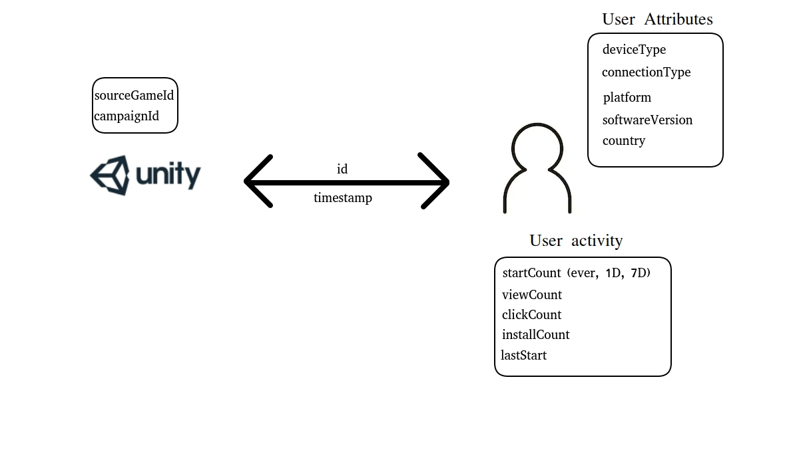

The objective of this exercise to build an end-to-end pipeline that is satisfies all the requirements mentioned in the `Task.md` file.

There is an option to work with Apache Airflow or Kubeflow. Since the developer is new to both, it is fairly straightforward to go with the Airflow approach and builds DAGs (ingest >> preprocess >> train >> evaluate >> deploy). Airflow offers numerous operator and the `PythonOperator`can easily help plug the functions and build the pipeline.

However, the developer knows that such an implementation comes at a cost. For instance, he will need to move to `KubernetesOperator` to run the tasks on a Kubernetes cluster for scalability. Additionally, he will need to opt for `CeleryExecutor` or any other distributed executor because sequential execution may become a bottleneck and under-utilize workers. Although, there should be a work around to use Airflow for the most part, it needs further evaluation.

Considering the above points (and knowing that Unity is using GCP services), it is a good idea to use Kubeflow pipelines.

Now, focusing on the architecture, there are broadly 3 steps:
- **Data** ingestion, validation, transformation, feature-generation, splitting.
- **Model** training, evaluation, serving.
- **Life cycle** monitoring, logging, iterating model.

There are numerous ways to approach the above steps and below is a purely GCP-based example for the same, courtesy Google blogs.

  
  

---

# Solution
  

## Data understanding

After an initial overview of all the features, we can bucket features in 4 broader categories, namely, company-side features, interaction features, user attributes and user activity.

Based on the provided field descriptors, we will represent the information flow in a logical and consistent way that binds back to how this data may have been generated.
  

A user arrives with the user attributes {device type, connection type, platform, software version, country} and a video ad is shown. The ad is associated with a campaign (campaign ID) and promotes a game (game ID). This leads to an impression event, which is the granularity of the provided data.
  

**Conversion funnel**:
(Assumptions based on the provided definition)

<u>*startCount*</u>: This refers to all the videos ads ever started on the user's device

<u>*viewCount*</u>: Since all impressions are implicitly viewed; the meaning of view, here, can imply that the ad was viewed for more than a specific time interval or completely. Thus, this refers to all the video ads viewed, as per definition, by the user.

<u>*clickCount*</u>: If the user click's on the ad while or after watching. This refers to all the ads that we clicked.

<u>*installCount*</u>: If the ad led to an installation. This refers to all previous installation via video ads.

**Note**: The definition says 'how many times the user has installed games from this network ever'. There is not further information about what a network is so we will assume that it means the Unity ad network.
  

**User journey**: When a user is impressed with an ad, the user can view -> click -> install. If the installation happens, install flag is set to 1 for the impression and other information is logged as usual.
  

**Other factors**: The installation flag also derives from factors outside the logged information. For example, the user may have clicked but the app/play store didn't function. Or the user was trying to press the skip/close button on the ad but clicked wrong and arrived at the app/play store. Overall, the user's propensity to install depends on the following factors:

- the game type or the user-recommendation match
- the ad placement; between some loading period vs in the middle of the play
- Funnel attributes with given user attributes i.e. ease of skipping or clicking, re-direct to app/play store, installation size, paid/free app.
- unknowns
  

With the above analysis, we can say that a campaign is a collection of video ads from various games and a game can be a part of multiple campaigns. There is no information if the video ad corresponding to a gameId-campaignId pair is unique for that pair or reused across all campaigns for that game.
  

## Components for pipeline

After the EDA, we can start designing the components for our kubeflow pipeline. We will follow `preprocess >> train >> test >> deploy`. We will remove the ingest component as the data is locally available.

> If time permits, we can add basic spark functionality coupled with a querying mechanism that can pull data dynamically form RDS, as an example to containerize the  ingestion process.

  
***
## ML pipeline
The pipeline solution will follow a similar but scaled-down pattern. The component structure will be preprocess >> train >> test >> deploy. Github actions will help with CI. The docker containers will be accessible via github (no secrets for sharing purpose, but the password will be changed in a week).